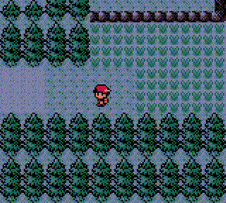
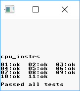
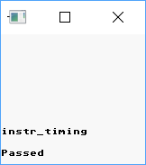

# Gameboy

Full featured Cross-platform GameBoy emulator. **Forever boys!**.

```s
$ cargo run -- "roms/Boxes (PD).gb"
```



Gameboy is developed by Rust, and fully tested on Windows, Ubuntu and Mac.

# Control

```
                _n_________________
                |_|_______________|_|
                |  ,-------------.  |
                | |  .---------.  | |
                | |  |         |  | |
                | |  |         |  | |
                | |  |         |  | |
                | |  |         |  | |
                | |  `---------'  | |
                | `---------------' |
                |   _ GAME BOY      |
   Up           | _| |_         ,-. | ----> Z
Left/Right <--- ||_ O _|   ,-. "._,"|
  Down          |  |_|    "._,"   A | ----> X
                |    _  _    B      |
                |   // //           |
                |  // //    \\\\\\  | ----> Enter/BackSpace
                |  `  `      \\\\\\ ,
                |________...______,"
```

# Tests

Thanks for [Blargg's Gameboy hardware test ROMs](https://github.com/retrio/gb-test-roms), I can simply verify my code. You can find the way how to run tests in `go.py`.


| Test Name    | Result                               |
|--------------|--------------------------------------|
| cpu_instrs   |    |
| instr_timing |  |

# Reference

- [https://github.com/gbdev/awesome-gbdev](https://github.com/gbdev/awesome-gbdev)
- [http://www.pastraiser.com/cpu/gameboy/gameboy_opcodes.html](http://www.pastraiser.com/cpu/gameboy/gameboy_opcodes.html)
- [https://ladecadence.net/trastero/listado%20juegos%20gameboy.html](https://ladecadence.net/trastero/listado%20juegos%20gameboy.html)
- [http://romhustler.net/roms/gbc/number](http://romhustler.net/roms/gbc/number)
- [http://gbdev.gg8.se/wiki/articles/CPU_Comparision_with_Z80](http://gbdev.gg8.se/wiki/articles/CPU_Comparision_with_Z80)
- [https://github.com/PoschR/Gameboy-Learning-Environment](https://github.com/PoschR/Gameboy-Learning-Environment)
- [https://mgba-emu.github.io/gbdoc/](https://mgba-emu.github.io/gbdoc/)
- [http://gbdev.gg8.se/wiki/articles/Main_Page](http://gbdev.gg8.se/wiki/articles/Main_Page)
- [https://gekkio.fi/files/gb-docs/gbctr.pdf](https://gekkio.fi/files/gb-docs/gbctr.pdf)
- [http://gameboy.mongenel.com/dmg/asmmemmap.html](http://gameboy.mongenel.com/dmg/asmmemmap.html)
- [http://bgb.bircd.org/pandocs.htm](http://bgb.bircd.org/pandocs.htm)

# Licenses

WTFPL.
