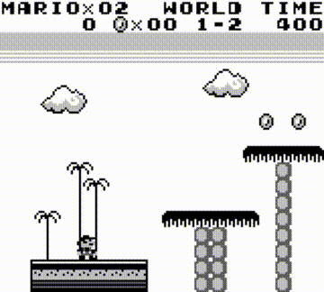
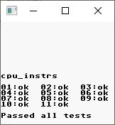
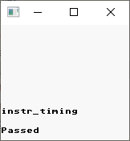

# Gameboy

Full-featured Cross-platform GameBoy emulator. **Forever boys!**



You can start a game with the following command. The following example uses the built-in game "SUPER MARIOLAND":

```s
$ cargo run --release -- "./res/sml.gb"
```

The following options are supported:

```text
-a, --enable-audio    Enable audio, default is false
-x, --scale-factor    Scale the video by a factor of 1, 2, 4, or 8
```

Gameboy is developed in Rust and has been thoroughly tested on Windows, Ubuntu, and Mac.

# Dependencies

This project depends on the following Rust libraries, which have native dependencies:

- [cpal](https://github.com/RustAudio/cpal)
- [minifb](https://github.com/emoon/rust_minifb)

You may need to install the native dependencies these libraries require before running this emulator.

For Ubuntu Linux, you can run:

```sh
sudo apt install libasound2-dev # Install CPAL dependencies
sudo apt install libxkbcommon-dev libwayland-cursor0 libwayland-dev # Install MiniFB dependencies
```

For Windows, you should install [Microsoft C++ Build Tools](https://aka.ms/vs/17/release/vs_BuildTools.exe).

# Controls

```
                _n_________________
                |_|_______________|_|
                |  ,-------------.  |
                | |  .---------.  | |
                | |  |         |  | |
                | |  |         |  | |
                | |  |         |  | |
                | |  |         |  | |
                | |  `---------'  | |
                | `---------------' |
                |   _ GAME BOY      |
   Up           | _| |_         ,-. | ----> Z
Left/Right <--- ||_ O _|   ,-. "._,"|
  Down          |  |_|    "._,"   A | ----> X
                |    _  _    B      |
                |   // //           |
                |  // //    \\\\\\  | ----> Enter/BackSpace
                |  `  `      \\\\\\ ,
                |________...______,"
```

# Tests

Thanks to [Blargg's Gameboy hardware test ROMs](https://github.com/retrio/gb-test-roms), I can easily verify my code. Run tests with the command:

```sh
$ cargo run --example blargg
```

| Test Name    | Result                              |
|--------------|-------------------------------------|
| cpu_instrs   |    |
| instr_timing |  |

# References

- [Gbdev](http://gbdev.gg8.se/wiki/articles/Main_Page)
- [Open Game Boy Documentation Project](https://mgba-emu.github.io/gbdoc/)
- [LR35902 Opcodes](https://rednex.github.io/rgbds/gbz80.7.html)
- [LR35902 Opcodes Table](http://www.pastraiser.com/cpu/gameboy/gameboy_opcodes.html)
- [Game Boy Memory Map](http://gameboy.mongenel.com/dmg/asmmemmap.html)
- [Game Boy Technical Data](http://bgb.bircd.org/pandocs.htm)
- [awesome-gbdev](https://github.com/gbdev/awesome-gbdev)
- [List of MBC roms](https://ladecadence.net/trastero/listado%20juegos%20gameboy.html)
- [Roms download](http://romhustler.net/roms/gbc/number)

# Licenses

MIT.
