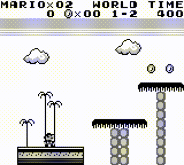
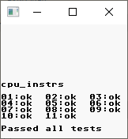
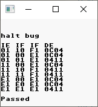
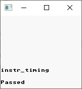
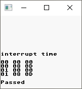

# Gameboy

Full-featured Cross-platform GameBoy emulator. **Forever boys!**



You can start a game with the following command. The following example uses the built-in game "SUPER MARIOLAND":

```sh
$ cargo run --release -- "./res/super_marioland.gb"
```

The following options are supported:

```text
-a, --enable-audio    Enable audio, default is false
-x, --scale-factor    Scale the video by a factor of 1, 2, 4, or 8
-s, --speed-factor    Set the emulator speed (1 for normal speed, 2 for double speed, etc.)
```

Gameboy is developed in Rust and has been thoroughly tested on Windows, Ubuntu, and Mac.

# Dependencies

This project depends on the following Rust libraries, which have native dependencies:

- [cpal](https://github.com/RustAudio/cpal)
- [minifb](https://github.com/emoon/rust_minifb)

You may need to install the native dependencies these libraries require before running this emulator.

For Ubuntu Linux, you can run:

```sh
sudo apt install libasound2-dev # Install CPAL dependencies
sudo apt install libxkbcommon-dev libwayland-cursor0 libwayland-dev # Install MiniFB dependencies
```

For Windows, you should install [Microsoft C++ Build Tools](https://aka.ms/vs/17/release/vs_BuildTools.exe).

# Controls

```
                _n_________________
                |_|_______________|_|
                |  ,-------------.  |
                | |  .---------.  | |
                | |  |         |  | |
                | |  |         |  | |
                | |  |         |  | |
                | |  |         |  | |
                | |  `---------'  | |
                | `---------------' |
                |   _ GAME BOY      |
   Up           | _| |_         ,-. | ----> Z
Left/Right <--- ||_ O _|   ,-. "._,"|
  Down          |  |_|    "._,"   A | ----> X
                |    _  _    B      |
                |   // //           |
                |  // //    \\\\\\  | ----> Enter/BackSpace
                |  `  `      \\\\\\ ,
                |________...______,"
```

# Tests

This project is a cycles-based hardware simulator that has passed all [Blargg's Gameboy hardware test ROMs](https://github.com/retrio/gb-test-roms) and [Mooneye Test Suite](https://github.com/Gekkio/mooneye-test-suite).

```sh
$ cargo run --example blargg
```

|   Test Name    |                Result                 |
| -------------- | ------------------------------------- |
| cpu_instrs     |      |
| halt_bug       |        |
| instr_timing   |    |
| interrupt_time |  |

```sh
$ cargo run --example mts
```

|                      Name                       |               Exit                |
| ----------------------------------------------- | --------------------------------- |
| acceptance/add_sp_e_timing.gb                   | <font color=#008000>Passed</font> |
| acceptance/bits/mem_oam.gb                      | <font color=#008000>Passed</font> |
| acceptance/bits/reg_f.gb                        | <font color=#008000>Passed</font> |
| acceptance/bits/unused_hwio-GS.gb               | <font color=#008000>Passed</font> |
| acceptance/boot_div-S.gb                        | <font color=#d3d3d3>Skiped</font> |
| acceptance/boot_div-dmg0.gb                     | <font color=#d3d3d3>Skiped</font> |
| acceptance/boot_div-dmgABCmgb.gb                | <font color=#008000>Passed</font> |
| acceptance/boot_div2-S.gb                       | <font color=#d3d3d3>Skiped</font> |
| acceptance/boot_hwio-S.gb                       | <font color=#d3d3d3>Skiped</font> |
| acceptance/boot_hwio-dmg0.gb                    | <font color=#d3d3d3>Skiped</font> |
| acceptance/boot_hwio-dmgABCmgb.gb               | <font color=#008000>Passed</font> |
| acceptance/boot_regs-dmg0.gb                    | <font color=#d3d3d3>Skiped</font> |
| acceptance/boot_regs-dmgABC.gb                  | <font color=#008000>Passed</font> |
| acceptance/boot_regs-mgb.gb                     | <font color=#d3d3d3>Skiped</font> |
| acceptance/boot_regs-sgb.gb                     | <font color=#d3d3d3>Skiped</font> |
| acceptance/boot_regs-sgb2.gb                    | <font color=#d3d3d3>Skiped</font> |
| acceptance/call_cc_timing.gb                    | <font color=#008000>Passed</font> |
| acceptance/call_cc_timing2.gb                   | <font color=#008000>Passed</font> |
| acceptance/call_timing.gb                       | <font color=#008000>Passed</font> |
| acceptance/call_timing2.gb                      | <font color=#008000>Passed</font> |
| acceptance/di_timing-GS.gb                      | <font color=#008000>Passed</font> |
| acceptance/div_timing.gb                        | <font color=#008000>Passed</font> |
| acceptance/ei_sequence.gb                       | <font color=#008000>Passed</font> |
| acceptance/ei_timing.gb                         | <font color=#008000>Passed</font> |
| acceptance/halt_ime0_ei.gb                      | <font color=#008000>Passed</font> |
| acceptance/halt_ime0_nointr_timing.gb           | <font color=#008000>Passed</font> |
| acceptance/halt_imePassed_timing.gb             | <font color=#008000>Passed</font> |
| acceptance/halt_imePassed_timing2-GS.gb         | <font color=#008000>Passed</font> |
| acceptance/if_ie_registers.gb                   | <font color=#008000>Passed</font> |
| acceptance/instr/daa.gb                         | <font color=#008000>Passed</font> |
| acceptance/interrupts/ie_push.gb                | <font color=#008000>Passed</font> |
| acceptance/intr_timing.gb                       | <font color=#008000>Passed</font> |
| acceptance/jp_cc_timing.gb                      | <font color=#008000>Passed</font> |
| acceptance/jp_timing.gb                         | <font color=#008000>Passed</font> |
| acceptance/ld_hl_sp_e_timing.gb                 | <font color=#008000>Passed</font> |
| acceptance/oam_dma/basic.gb                     | <font color=#008000>Passed</font> |
| acceptance/oam_dma/reg_read.gb                  | <font color=#008000>Passed</font> |
| acceptance/oam_dma/sources-GS.gb                | <font color=#008000>Passed</font> |
| acceptance/oam_dma_restart.gb                   | <font color=#008000>Passed</font> |
| acceptance/oam_dma_start.gb                     | <font color=#008000>Passed</font> |
| acceptance/oam_dma_timing.gb                    | <font color=#008000>Passed</font> |
| acceptance/pop_timing.gb                        | <font color=#008000>Passed</font> |
| acceptance/ppu/hblank_ly_scx_timing-GS.gb       | <font color=#008000>Passed</font> |
| acceptance/ppu/intr_Passed_2_timing-GS.gb       | <font color=#008000>Passed</font> |
| acceptance/ppu/intr_2_0_timing.gb               | <font color=#008000>Passed</font> |
| acceptance/ppu/intr_2_mode0_timing.gb           | <font color=#008000>Passed</font> |
| acceptance/ppu/intr_2_mode0_timing_sprites.gb   | <font color=#008000>Passed</font> |
| acceptance/ppu/intr_2_mode3_timing.gb           | <font color=#008000>Passed</font> |
| acceptance/ppu/intr_2_oam_ok_timing.gb          | <font color=#008000>Passed</font> |
| acceptance/ppu/lcdon_timing-GS.gb               | <font color=#008000>Passed</font> |
| acceptance/ppu/lcdon_write_timing-GS.gb         | <font color=#008000>Passed</font> |
| acceptance/ppu/stat_irq_blocking.gb             | <font color=#008000>Passed</font> |
| acceptance/ppu/stat_lyc_onoff.gb                | <font color=#008000>Passed</font> |
| acceptance/ppu/vblank_stat_intr-GS.gb           | <font color=#008000>Passed</font> |
| acceptance/push_timing.gb                       | <font color=#008000>Passed</font> |
| acceptance/rapid_di_ei.gb                       | <font color=#008000>Passed</font> |
| acceptance/ret_cc_timing.gb                     | <font color=#008000>Passed</font> |
| acceptance/ret_timing.gb                        | <font color=#008000>Passed</font> |
| acceptance/reti_intr_timing.gb                  | <font color=#008000>Passed</font> |
| acceptance/reti_timing.gb                       | <font color=#008000>Passed</font> |
| acceptance/rst_timing.gb                        | <font color=#008000>Passed</font> |
| acceptance/serial/boot_sclk_align-dmgABCmgb.gb  | <font color=#008000>Passed</font> |
| acceptance/timer/div_write.gb                   | <font color=#008000>Passed</font> |
| acceptance/timer/rapid_toggle.gb                | <font color=#008000>Passed</font> |
| acceptance/timer/tim00.gb                       | <font color=#008000>Passed</font> |
| acceptance/timer/tim00_div_trigger.gb           | <font color=#008000>Passed</font> |
| acceptance/timer/tim0Passed.gb                  | <font color=#008000>Passed</font> |
| acceptance/timer/tim0Passed_div_trigger.gb      | <font color=#008000>Passed</font> |
| acceptance/timer/timPassed0.gb                  | <font color=#008000>Passed</font> |
| acceptance/timer/timPassed0_div_trigger.gb      | <font color=#008000>Passed</font> |
| acceptance/timer/timPassedPassed.gb             | <font color=#008000>Passed</font> |
| acceptance/timer/timPassedPassed_div_trigger.gb | <font color=#008000>Passed</font> |
| acceptance/timer/tima_reload.gb                 | <font color=#008000>Passed</font> |
| acceptance/timer/tima_write_reloading.gb        | <font color=#008000>Passed</font> |
| acceptance/timer/tma_write_reloading.gb         | <font color=#008000>Passed</font> |
| emulator-only/mbcPassed/bits_bankPassed.gb      | <font color=#008000>Passed</font> |
| emulator-only/mbcPassed/bits_bank2.gb           | <font color=#008000>Passed</font> |
| emulator-only/mbcPassed/bits_mode.gb            | <font color=#008000>Passed</font> |
| emulator-only/mbcPassed/bits_ramg.gb            | <font color=#008000>Passed</font> |
| emulator-only/mbcPassed/multicart_rom_8Mb.gb    | <font color=#d3d3d3>Skiped</font> |
| emulator-only/mbcPassed/ram_256kb.gb            | <font color=#008000>Passed</font> |
| emulator-only/mbcPassed/ram_64kb.gb             | <font color=#008000>Passed</font> |
| emulator-only/mbcPassed/rom_Passed6Mb.gb        | <font color=#008000>Passed</font> |
| emulator-only/mbcPassed/rom_PassedMb.gb         | <font color=#008000>Passed</font> |
| emulator-only/mbcPassed/rom_2Mb.gb              | <font color=#008000>Passed</font> |
| emulator-only/mbcPassed/rom_4Mb.gb              | <font color=#008000>Passed</font> |
| emulator-only/mbcPassed/rom_5Passed2kb.gb       | <font color=#008000>Passed</font> |
| emulator-only/mbcPassed/rom_8Mb.gb              | <font color=#008000>Passed</font> |
| emulator-only/mbc2/bits_ramg.gb                 | <font color=#008000>Passed</font> |
| emulator-only/mbc2/bits_romb.gb                 | <font color=#008000>Passed</font> |
| emulator-only/mbc2/bits_unused.gb               | <font color=#008000>Passed</font> |
| emulator-only/mbc2/ram.gb                       | <font color=#008000>Passed</font> |
| emulator-only/mbc2/rom_PassedMb.gb              | <font color=#008000>Passed</font> |
| emulator-only/mbc2/rom_2Mb.gb                   | <font color=#008000>Passed</font> |
| emulator-only/mbc2/rom_5Passed2kb.gb            | <font color=#008000>Passed</font> |
| emulator-only/mbc5/rom_Passed6Mb.gb             | <font color=#008000>Passed</font> |
| emulator-only/mbc5/rom_PassedMb.gb              | <font color=#008000>Passed</font> |
| emulator-only/mbc5/rom_2Mb.gb                   | <font color=#008000>Passed</font> |
| emulator-only/mbc5/rom_32Mb.gb                  | <font color=#008000>Passed</font> |
| emulator-only/mbc5/rom_4Mb.gb                   | <font color=#008000>Passed</font> |
| emulator-only/mbc5/rom_5Passed2kb.gb            | <font color=#008000>Passed</font> |
| emulator-only/mbc5/rom_64Mb.gb                  | <font color=#008000>Passed</font> |
| emulator-only/mbc5/rom_8Mb.gb                   | <font color=#008000>Passed</font> |
| madness/mgb_oam_dma_halt_sprites.gb             | <font color=#d3d3d3>Skiped</font> |
| manual-only/sprite_priority.gb                  | <font color=#d3d3d3>Skiped</font> |
| misc/bits/unused_hwio-C.gb                      | <font color=#d3d3d3>Skiped</font> |
| misc/boot_div-A.gb                              | <font color=#d3d3d3>Skiped</font> |
| misc/boot_div-cgb0.gb                           | <font color=#d3d3d3>Skiped</font> |
| misc/boot_div-cgbABCDE.gb                       | <font color=#d3d3d3>Skiped</font> |
| misc/boot_hwio-C.gb                             | <font color=#d3d3d3>Skiped</font> |
| misc/boot_regs-A.gb                             | <font color=#d3d3d3>Skiped</font> |
| misc/boot_regs-cgb.gb                           | <font color=#d3d3d3>Skiped</font> |
| misc/ppu/vblank_stat_intr-C.gb                  | <font color=#d3d3d3>Skiped</font> |
| utils/bootrom_dumper.gb                         | <font color=#d3d3d3>Skiped</font> |
| utils/dump_boot_hwio.gb                         | <font color=#d3d3d3>Skiped</font> |

# References

- [Gbdev](http://gbdev.gg8.se/wiki/articles/Main_Page)
- [Open Game Boy Documentation Project](https://mgba-emu.github.io/gbdoc/)
- [LR35902 Opcodes](https://rednex.github.io/rgbds/gbz80.7.html)
- [LR35902 Opcodes Table](http://www.pastraiser.com/cpu/gameboy/gameboy_opcodes.html)
- [Game Boy Memory Map](http://gameboy.mongenel.com/dmg/asmmemmap.html)
- [Game Boy Technical Data](http://bgb.bircd.org/pandocs.htm)
- [awesome-gbdev](https://github.com/gbdev/awesome-gbdev)
- [List of MBC roms](https://ladecadence.net/trastero/listado%20juegos%20gameboy.html)
- [Roms download](http://romhustler.net/roms/gbc/number)

# Licenses

MIT.
